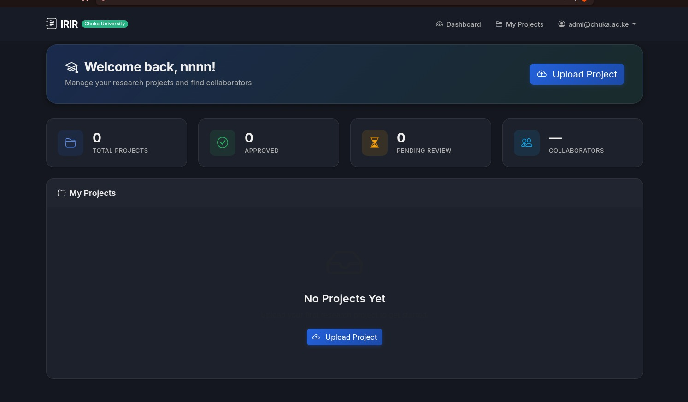
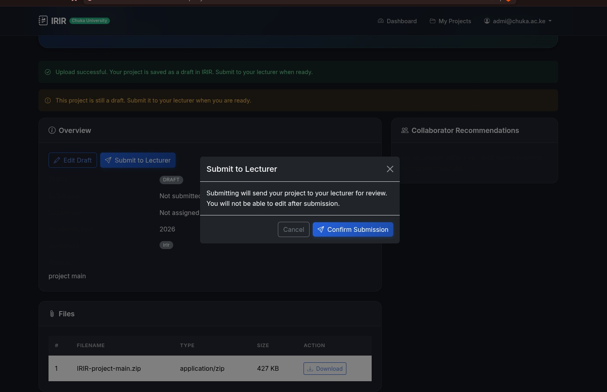
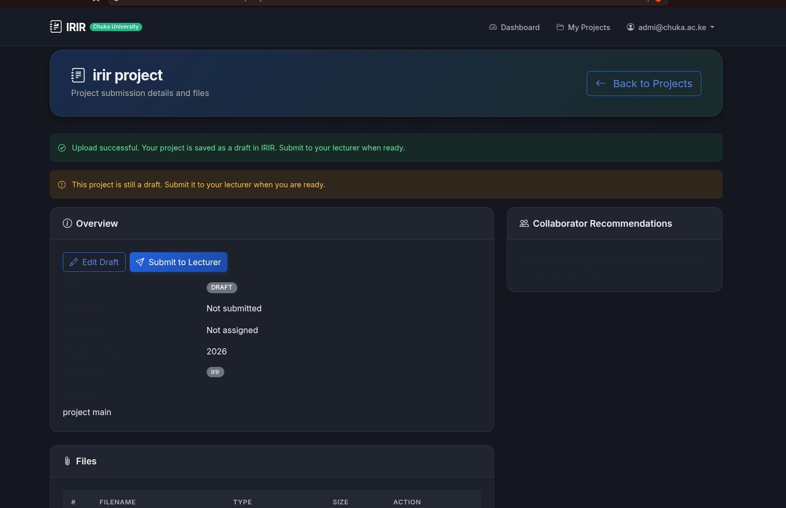
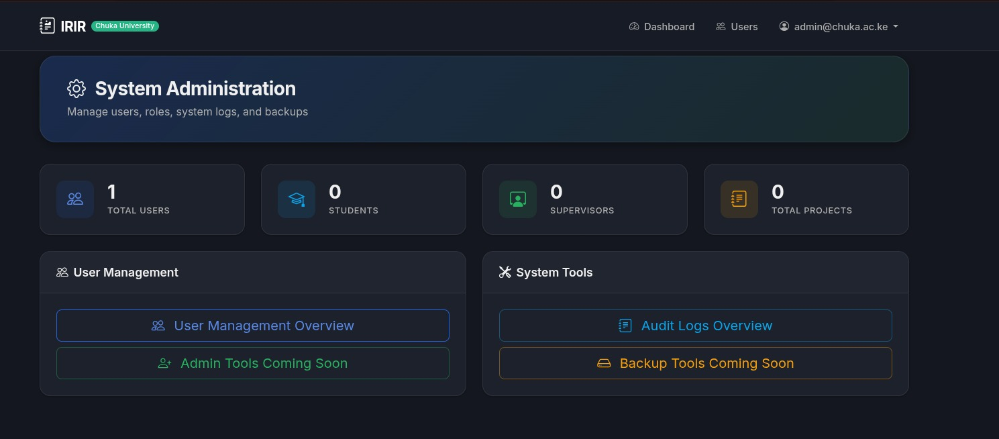

 UniSubmit | University Submission & Innovation Repository


**UniSubmit** is a specialized digital repository and submission system designed for university departments to manage the entire lifecycle of student research projects. It streamlines project uploads, supervisor feedback, and final archival, ensuring academic integrity and fostering innovation.



---

## ❓ Why UniSubmit?

Academic research management is often fragmented, with critical final-year projects scattered across disconnected drives or physical archives. **UniSubmit** solves this by providing:

*   **A Centralized Knowledge Hub**: Preserving every graduates' contribution in a secure, searchable environment.
*   **A Continuous Feedback Loop**: Closing the gap between students and supervisors with real-time project tracking and feedback.
*   **High Academic Integrity**: Identifying potential plagiarism early through automated similarity scanning.
*   **Discovery for Freshmen**: Providing a library of past innovations to spark inspiration for future research.

Soon, **UniSubmit** will serve as the primary submission portal for **fourth-year final projects**, specifically tailored for departmental defenses and final thesis submissions.

---

## ✨ Key Features

### 🛡️ Plagiarism Prevention & Integrity
Each submission is automatically analyzed against the existing repository's database using advanced document extraction to ensure original work. High similarity scores trigger automated internal flags.



### 🔍 Project Discovery & Innovation
Projects are indexed with searchable keywords, helping students find relevant past research to build upon. Projects that reach the "Incubation" stage are showcased for their innovation.



### 📋 Seamless Workflow
Students can easily manage their project lifecycle—from draft stages to final review.


### 🛡️ Administration & Oversight
Dedicated administrative panels for managing users, tracking audit logs, and supervising department-wide research trends.



---

## 🚀 How to Run UniSubmit

Getting the application running is simple. Follow these steps for your preferred environment:

### Method 1: Local Development (H2 In-Memory)
This is the fastest way to preview the app without a full MySQL setup.
1.  **Clone the Repo:**
    ```bash
    git clone https://github.com/your-username/unisubmit.git
    cd unisubmit
    ```
2.  **Build and Run:**
    ```bash
    mvn spring-boot:run -Dspring-boot.run.profiles=h2
    ```
3.  **Access:**
    *   App: `http://localhost:8080`
    *   H2 Console: `http://localhost:8080/h2-console` (JDBC: `jdbc:h2:mem:irir_db`)
    *   **Default Admin:** `admin@chuka.ac.ke` / `Admin@2024`

### Method 2: Production/Full Setup (MySQL)
1.  **Database Initialisation:** Create a database named `irir_db`.
    ```sql
    CREATE DATABASE IF NOT EXISTS irir_db;
    ```
2.  **Env Config:** Set your environment variables (optional) or update `application.properties`:
    ```bash
    export IRIR_DB_PASSWORD='your-password'
    ```
3.  **Run:**
    ```bash
    mvn spring-boot:run
    ```

---

## 🛠️ Tech Stack

*   **Backend:** Java 17, Spring Boot 3.2.x
*   **Persistence:** Spring Data JPA + Hibernate
*   **Security:** Spring Security (RBAC & BCrypt)
*   **Frontend:** Thymeleaf + Bootstrap 5
*   **Analytics:** Apache Tika/PDFBox (Similarity analysis)

---

## 📄 License

This project is licensed under the MIT License - see the [LICENSE](LICENSE) file for details.

---

*Developed for Chuka University - Empowering Academic Innovation.*
