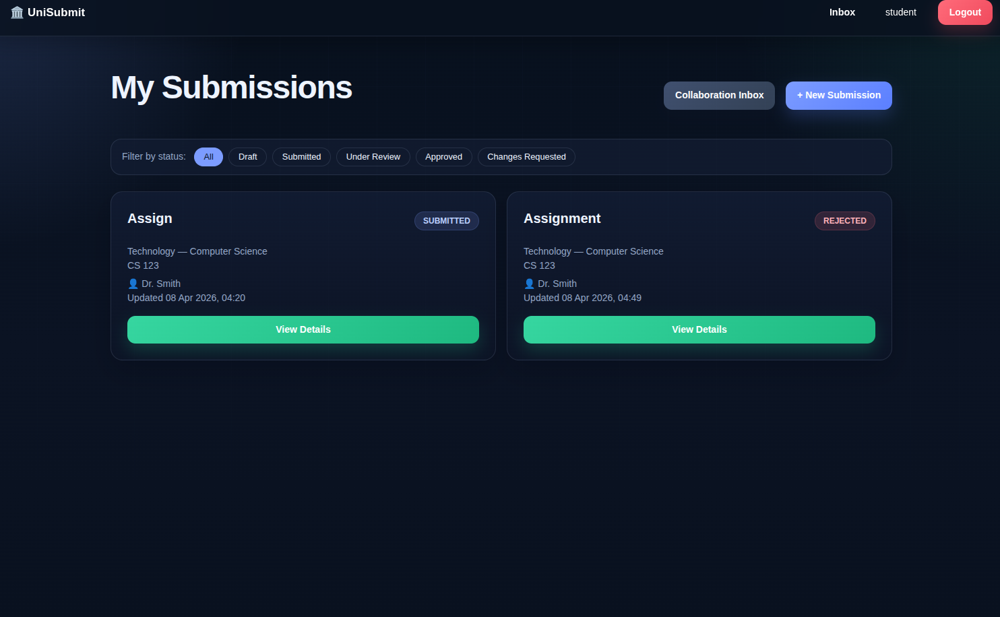
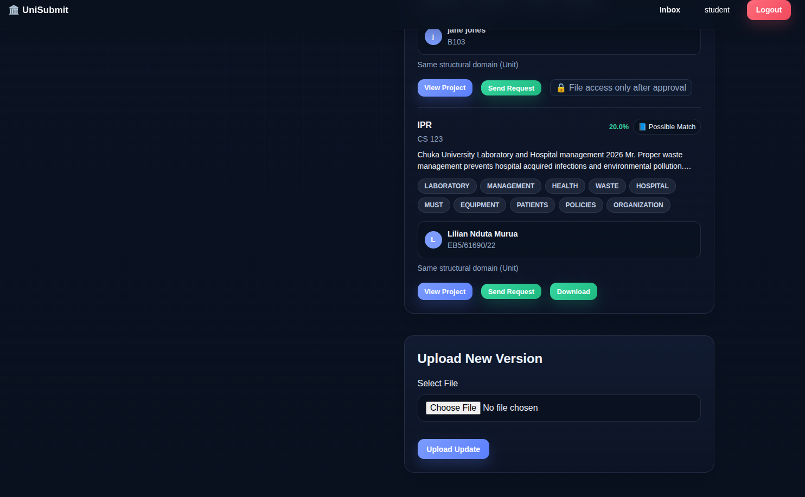
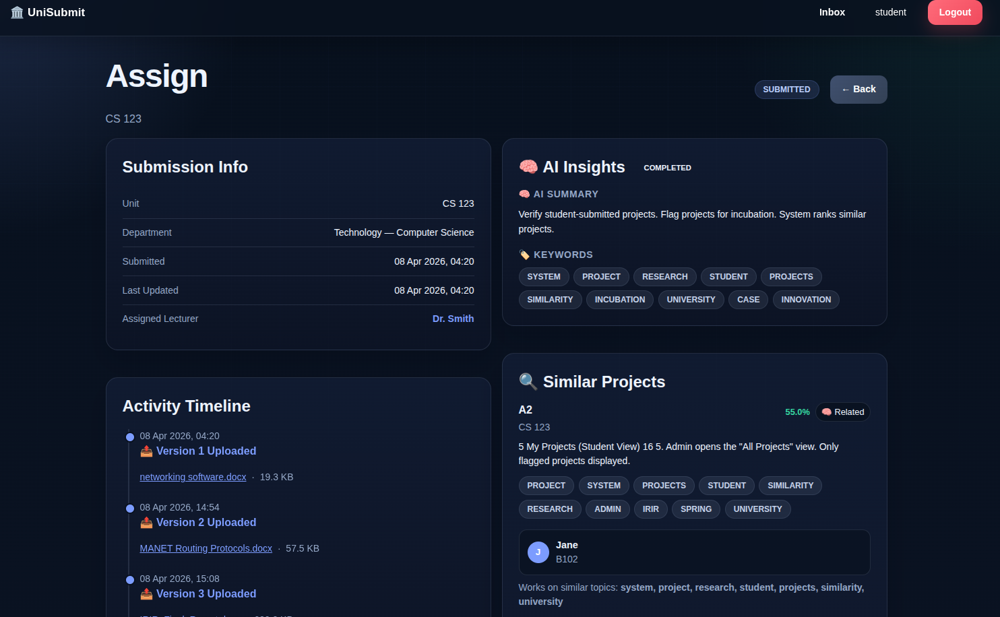
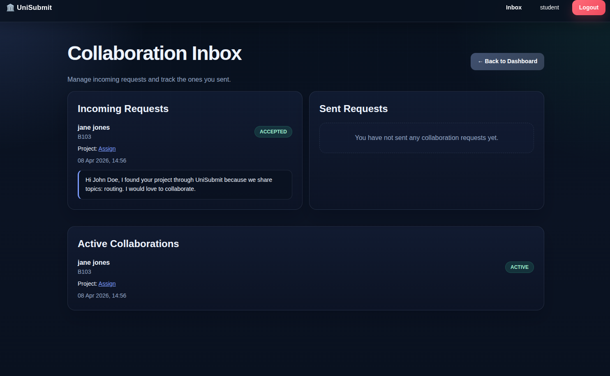
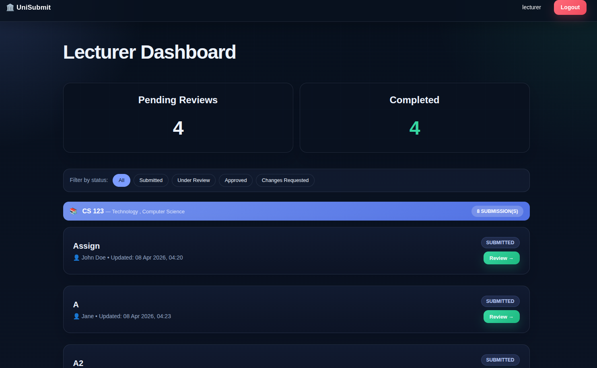
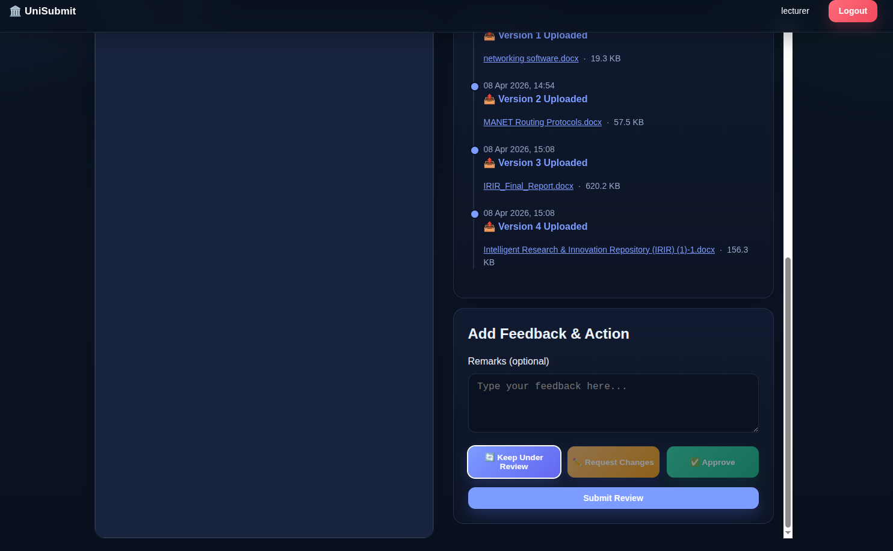
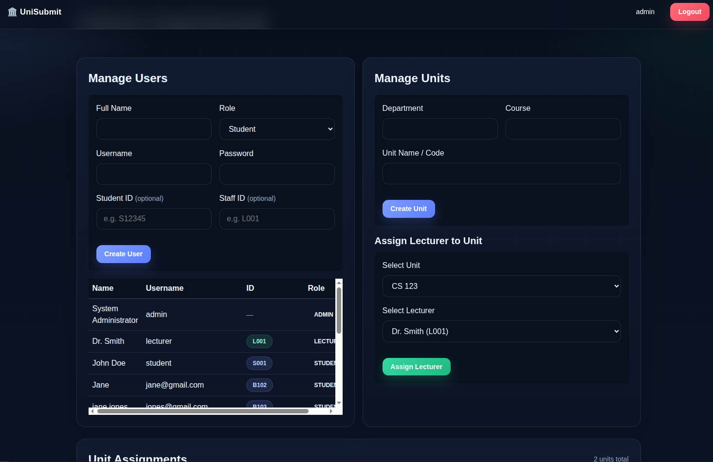
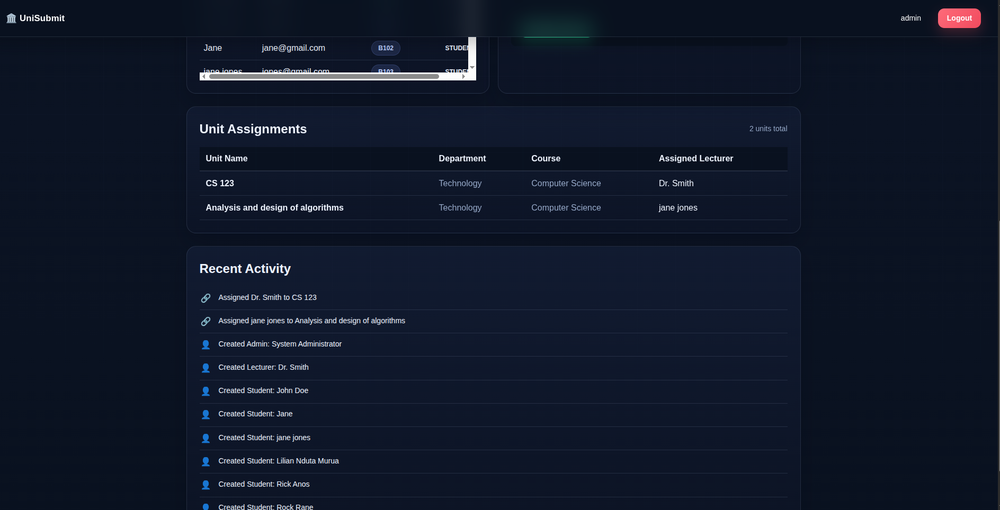

# UniSubmit

UniSubmit is a Spring Boot academic submission platform for students, lecturers, and administrators. It combines project submission, version history, lecturer review, AI-assisted summaries, similar-project discovery, collaboration requests, and academic unit management in one server-rendered application.

The application is intentionally built as a full-stack Spring Boot + Thymeleaf system. It should be deployed as a Java backend service, not as a static frontend on Vercel.

## Screenshots

### Student Workspace






### Lecturer Review




### Administration




## Features

- Student registration, sign-in, project creation, and version uploads.
- Lecturer review queues grouped by unit, with feedback and status decisions.
- AI workspace for summary, keywords, processing states, retry handling, and similar-project discovery.
- Collaboration request inbox with incoming, outgoing, and accepted collaboration views.
- Admin management for users, roles, student/staff identifiers, units, lecturer assignments, and activity.
- PostgreSQL persistence with file uploads stored on disk or a mounted volume.
- Docker and Docker Compose support for local and production-like environments.

## Architecture

UniSubmit is a conventional layered Spring application:

- `controller`: Spring MVC routes for auth, student, lecturer, admin, files, AI insight API, and health checks.
- `service`: business workflows for submissions, access control, AI analysis, recommendations, users, units, and collaboration.
- `repository`: Spring Data JPA repositories.
- `domain`: JPA entities and enums.
- `templates`: Thymeleaf pages and shared fragments.
- `static`: global CSS, JavaScript, and favicon assets.

The UI is server-rendered with Thymeleaf and enhanced with a small amount of dependency-free JavaScript for navigation, filtering, AI polling, review actions, table search, and confirmations.

## Tech Stack

- Java 17
- Spring Boot 4
- Spring MVC, Spring Security, Spring Data JPA
- Thymeleaf
- PostgreSQL
- Maven
- Docker

## Local Development

### Option 1: Docker Compose

```bash
cp .env.example .env
docker compose up --build
```

Open:

```text
http://localhost:8080
```

Docker Compose starts PostgreSQL, waits for it to become healthy, then starts UniSubmit with persistent Docker volumes for the database and uploads.

### Option 2: Maven + Local PostgreSQL

Create a PostgreSQL database named `unisubmit`, then run:

```bash
cp .env.example .env
```

Set the environment variables from `.env.example`, then start the app:

```bash
./mvnw spring-boot:run
```

On Windows PowerShell:

```powershell
$env:PGHOST="localhost"
$env:PGPORT="5432"
$env:PGDATABASE="unisubmit"
$env:PGUSER="unisubmit"
$env:PGPASSWORD="unisubmit"
$env:APP_UPLOAD_DIR="uploads"
.\mvnw.cmd spring-boot:run
```

## Environment Variables

| Variable | Required | Default | Description |
| --- | --- | --- | --- |
| `PORT` | No | `8080` | HTTP port used by Spring Boot. |
| `PGHOST` | No | `localhost` | PostgreSQL host when not using `JDBC_DATABASE_URL`. |
| `PGPORT` | No | `5432` | PostgreSQL port. |
| `PGDATABASE` | No | `unisubmit` | PostgreSQL database name. |
| `PGUSER` | No | `unisubmit` | PostgreSQL username. |
| `PGPASSWORD` | No | `unisubmit` | PostgreSQL password. |
| `JDBC_DATABASE_URL` | No | built from `PG*` vars | Full JDBC URL for managed PostgreSQL providers. |
| `APP_UPLOAD_DIR` | No | `uploads` | Directory where uploaded files are stored. |
| `DB_MAX_POOL_SIZE` | No | `5` | Maximum Hikari database connections. |
| `DB_MIN_IDLE` | No | `1` | Minimum idle Hikari connections. |
| `DB_CONNECTION_TIMEOUT_MS` | No | `30000` | Database connection timeout in milliseconds. |

## Supabase PostgreSQL

Use Supabase as the PostgreSQL provider and deploy UniSubmit on a Java-capable host such as Render, Railway, Fly.io, a VM, or any Docker platform.

For Render, prefer Supabase's **Session pooler** connection string unless you have confirmed your Render service can reach Supabase's IPv6-only direct host or you have enabled Supabase's IPv4 add-on. Do not use the Transaction pooler for this app unless you also disable prepared statements at the JDBC/Hibernate layer.

Set these variables on Render:

```env
JDBC_DATABASE_URL=jdbc:postgresql://aws-0-region.pooler.supabase.com:5432/postgres?sslmode=require
PGUSER=postgres.your-project-ref
PGPASSWORD=your-supabase-password
APP_UPLOAD_DIR=/tmp/uploads
DB_MAX_POOL_SIZE=5
DB_MIN_IDLE=1
```

Do not deploy this application to Vercel as a static site. UniSubmit is not a separate frontend bundle; it is a server-rendered Spring Boot application.

## Render Deployment

This repository includes `render.yaml` for a Docker-based Render Web Service. It configures:

- Docker runtime using the root `Dockerfile`
- HTTP health check at `/health`
- `PORT=8080`
- temporary upload storage at `/tmp/uploads`
- Supabase database variables entered as secrets

Render persistent disks require a paid web-service plan. The checked-in Blueprint avoids disks so it can deploy without billing details. Uploaded files will be lost whenever the free service restarts or redeploys. When billing is available, add a persistent disk mounted at `/app/uploads` and change `APP_UPLOAD_DIR` to `/app/uploads`.

## Docker Deployment

Build the production image:

```bash
docker build -t unisubmit .
```

Run it with PostgreSQL variables:

```bash
docker run --rm -p 8080:8080 \
  -e JDBC_DATABASE_URL="jdbc:postgresql://host:5432/unisubmit?sslmode=require" \
  -e PGUSER="postgres" \
  -e PGPASSWORD="password" \
  -e APP_UPLOAD_DIR="/app/uploads" \
  -v unisubmit-uploads:/app/uploads \
  unisubmit
```

Uploaded files should be backed by a persistent volume in production.

## Testing And Verification

Compile the project:

```bash
./mvnw compile
```

Run tests:

```bash
./mvnw test
```

Some integration tests may require a reachable PostgreSQL database, depending on the active test configuration.

## Roadmap

- Add first-class pagination and server-side search for large admin datasets.
- Add rubric-aware AI review support once backend fields are available.
- Add richer audit logging instead of deriving recent activity from current records.
- Add object storage support for uploaded files.
- Add database migrations with Flyway or Liquibase.
- Add screenshot-based UI regression tests for lecturer and admin workflows.

## Contributing

1. Create a branch for your change.
2. Keep business logic changes separate from presentation changes.
3. Run `./mvnw compile` before opening a pull request.
4. Include screenshots for UI changes.
5. Document any new environment variables.

## License

No license has been declared yet. Add one before distributing or accepting external contributions.
